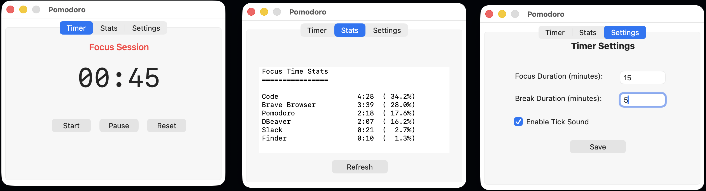

# Pomodoro Timer

macOS menu bar timer with focus tracking.

## Screenshots



## Build

```bash
./build.sh
```

## Features

- Customizable work/break durations
- Focus time statistics
- Optional tick sound
- Desktop notifications

## Usage

Install `Pomodoro.dmg` and run from Applications.
